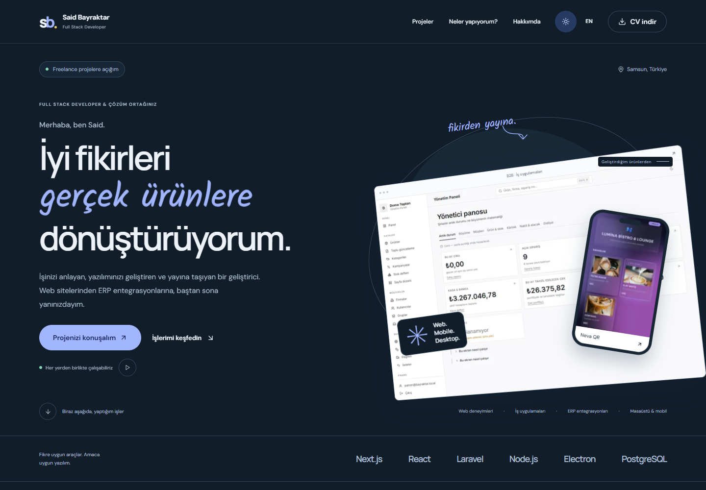
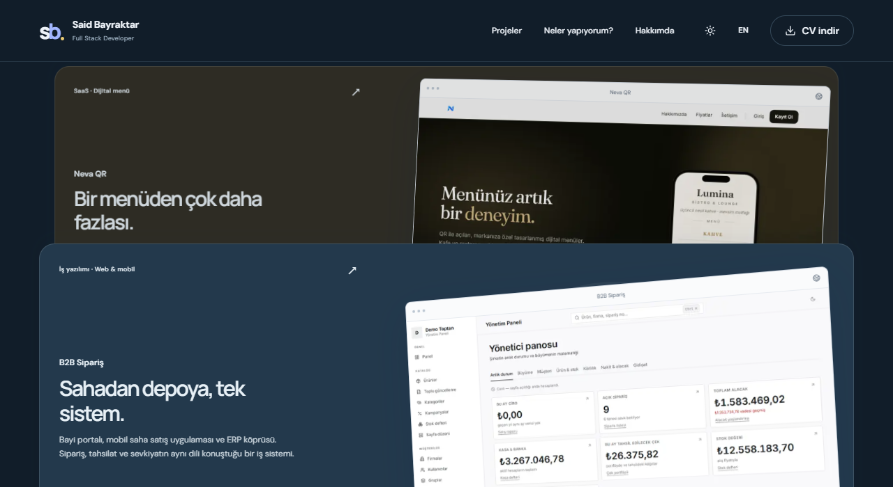
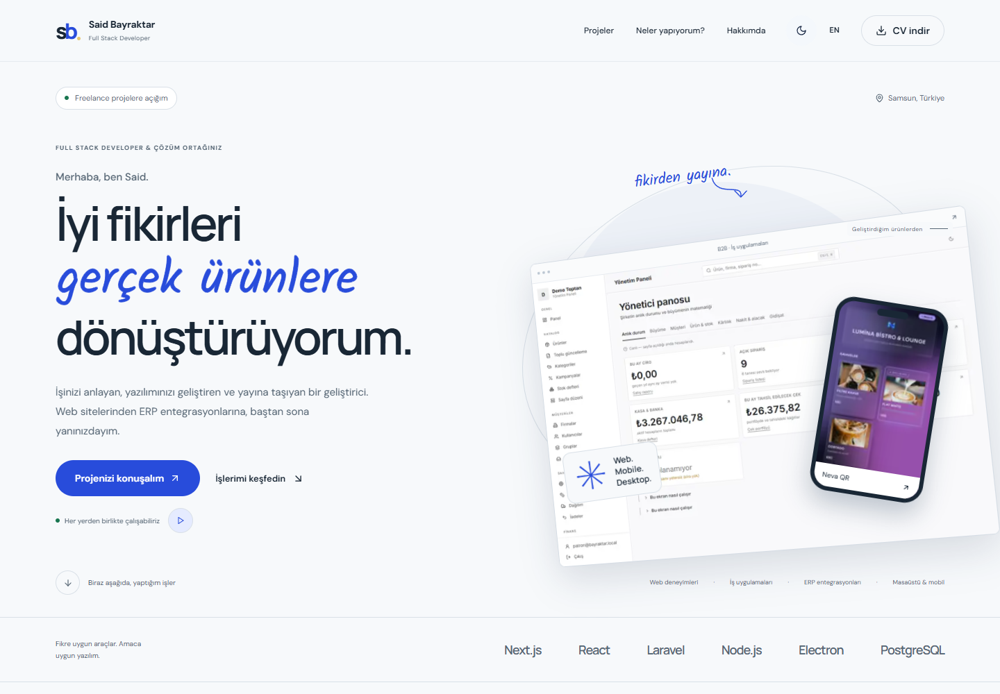
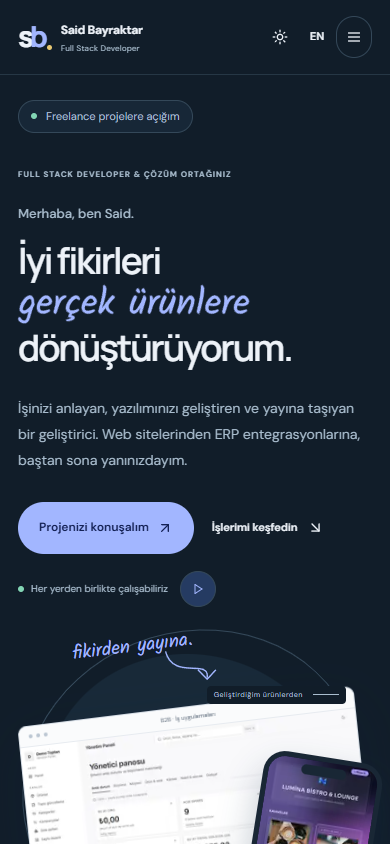
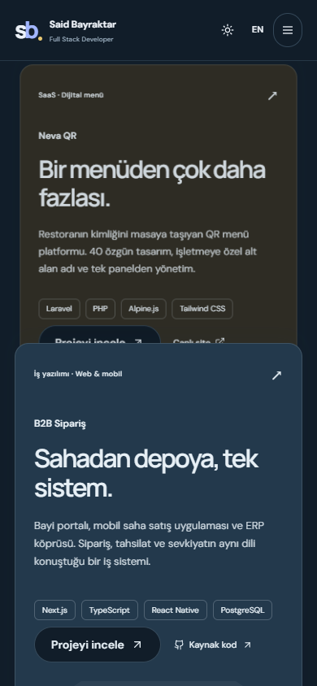

<div align="center">


# BAYRAKTAR

### İyi fikirleri gerçek ürünlere dönüştürüyorum.

**Said Bayraktar · Full Stack Developer**<br />
Web deneyimleri, iş uygulamaları ve ERP entegrasyonları. Fikirden yayına.

<p>
  
  
  
  
  
</p>

[Deneyim](#deneyim) · [Projeler](#projeler) · [Ekranlar](#ekranlar) · [Kurulum](#kurulum) · [İletişim](#iletisim)



<sub>Gerçek projeler. Gerçek ürün ekranları. Bana ait bir dijital vitrin.</sub>

</div>

<br />

| **10 proje hikâyesi** | **3 kayan proje paneli** | **2 arayüz dili** | **4 PDF özgeçmiş** |
| :---: | :---: | :---: | :---: |
| Problem → çözüm → sonuç | Ekranı kaplayan, üst üste ilerleyen sunum | Türkçe / English | Yazılım & IT destek · TR / EN |

Bu site, geliştirdiğim ürünleri ve çalışma biçimimi bir araya getiriyor. Ziyaretçiler projelerin arkasındaki ihtiyacı keşfedebilir, deneyimimi inceleyebilir ve kendi projeleri için bana ulaşabilir. Tasarımın merkezinde koyu bir palet, geniş tipografi, değişen el yazıları ve kaydırmayla ilerleyen proje hikâyeleri var.

<a id="deneyim"></a>

## ✦ Tasarımın içinde hareket var

| | Deneyim |
| :--- | :--- |
| **✍️ Kendini yeniden yazan başlık** | “Gerçek ürünlere”, “web deneyimlerine” ve “akıllı sistemlere” ifadeleri yaklaşık 4,2 saniyede bir SVG konturlarıyla yeniden çizilir. Animasyon duraklatılıp sürdürülebilir. |
| **↗ Kaydırmayla açılan projeler** | Lenis ile yumuşak kaydırma. Yeni proje paneli yükselirken önceki panel küçülür ve geriye çekilir; yukarı kaydırıldığında hareket tersine döner. |
| **◐ Koyu başlayan, tercihini hatırlayan tema** | İlk ziyaret koyu temayla açılır. Açık/koyu tema ve TR/EN seçimi sonraki ziyaretlerde korunur. |
| **⌘ Güncel GitHub vitrini** | Herkese açık depolar API üzerinden gelir. Kategori filtreleri, genişletilebilir liste ve yükleme hatasında tekrar deneme bulunur. |
| **↓ Rolüne göre özgeçmiş** | Full Stack Developer ve IT Support Specialist için Türkçe/İngilizce PDF önizleme ve indirme. |
| **↔ Her ekrana uyum** | Mobil menü, ekran boyutuna uyarlanan paneller, klavye erişimi ve hareket azaltma tercihine uygun davranış. |



<p align="center"><sub>Kayan proje vitrininin geçiş anı. Görseller, çalışan sitenin ekran görüntüleridir.</sub></p>

<a id="projeler"></a>

## ✦ Kodun gerçek hayattaki karşılığı

Vitrindeki her proje; ihtiyacı, uygulanan çözümü ve ortaya çıkan sonucu anlatan ayrı bir detay sayfasına sahip.

| Seçilmiş proje | Çözdüğü ihtiyaç | Teknolojiler |
| :--- | :--- | :--- |
| **[Neva QR](https://nevaqr.com)** | Restoranlar için 40 tasarım, alt alan adı yayını ve QR erişimiyle dijital menü yönetimi. | Laravel · Alpine.js · Tailwind CSS · SQLite · Cloudflare |
| **[B2B Sipariş](https://github.com/saidbayraqtars/b2b-order-system)** | Bayi portalı, mobil satış uygulaması ve ERP köprüsüyle sipariş, tahsilat ve sevkiyat akışı. | Next.js · React Native · PostgreSQL · Prisma · Turborepo |
| **[Vega Ticket](https://github.com/saidbayraqtars/vega-ticket-sistem-releases)** | Teknik servis kabulü, müşteri kayıtları ve WhatsApp bildirimlerini bir araya getiren masaüstü uygulaması. | Electron · Node.js · SQL Server · WhatsApp |

<details>
<summary><strong>Diğer 7 proje hikâyesini keşfet</strong></summary>

<br />

| Proje | Odak | Portföy rotası |
| :--- | :--- | :--- |
| **SeaWatch** | Deniz trafiği, AIS verisi ve harita üzerinde gemi takibi | `/projects/seawatch` |
| **Galya Panel** | ERP verileriyle stok, maliyet, sayım ve fatura takibi | `/projects/galya-panel` |
| **Hızlı Belge Doldurucu** | Belge, kasa ve dara işlemlerinde günlük iş yükünü azaltan otomasyon | `/projects/hizli-belge` |
| **Damrenur Günel** | Klinik psikolog için kurumsal web sitesi | `/projects/damrenur-gunel` |
| **Expert Bilişim** | Teknik hizmetlerin ve kurumsal kimliğin dijital sunumu | `/projects/expert-bilisim` |
| **PDF → Excel** | PDF içindeki verilerin işlenebilir tablolara dönüştürülmesi | `/projects/pdf-xlsx` |
| **TeknoKlinik Toner** | Toner ve sarf malzemesi takibi | `/projects/teknoklinik-toner` |

Kaynak kod ve uygulama sürümü bağlantıları sitede ayrı etiketlenir. Vega Ticket bağlantısı kurulum ve sürüm deposuna gider. Özel projeler, kaynak kodları bu depoya eklenmeden tanıtılır.

</details>

<a id="ekranlar"></a>

## ✦ Aynı karakter, farklı ekranlar

<details>
<summary><strong>☀️ Açık tema · Masaüstü</strong></summary>

<br />


</details>

<br />

<table>
  <tr>
    <th width="50%">Mobil · Açılış</th>
    <th width="50%">Mobil · Kayan proje vitrini</th>
  </tr>
  <tr>
    <td align="center"></td>
    <td align="center"></td>
  </tr>
</table>

<a id="kurulum"></a>

## ✦ Yerelde çalıştır

**Gereksinimler:** Node.js **20.9+**, npm ve Git. Depoyu klonlamak için GitHub hesabının erişimi olmalı.

```bash
git clone https://github.com/saidbayraqtars/bayraktar.git
cd bayraktar
npm ci
npm run dev
```

Siteyi **[localhost:3000](http://localhost:3000)** adresinde aç. Temel kullanım için veritabanı veya API anahtarı gerekmez; GitHub vitrini ve ilk derlemedeki Google Fonts indirmesi internet bağlantısı kullanır.

<details>
<summary><strong>🧩 Teknoloji ve klasör yapısı</strong></summary>

<br />

| Katman | Tercih |
| :--- | :--- |
| Uygulama | Next.js 16 App Router · React 19 · TypeScript 5 |
| Arayüz | Tailwind CSS 4 · shadcn/ui · Radix · Lucide |
| Kaydırma | Lenis · sticky paneller · kaydırmaya bağlı dönüşümler |
| El yazısı | opentype.js · SVG konturları · yerel Kalam fontu |
| Tipografi | Manrope · DM Sans · Kalam |
| İçerik | TypeScript içinde TR/EN metinler ve proje hikâyeleri |
| Doğrulama | ESLint · TypeScript · Playwright · axe-core |

```text
bayraktar/
├── app/
│   ├── api/github/route.ts     # GitHub verisi ve hata yanıtları
│   ├── projects/[slug]/       # 10 statik proje detay sayfası
│   ├── globals.css            # Temalar, tipografi ve responsive düzen
│   └── page.tsx               # Ana sayfa bileşimi
├── components/
│   ├── sections/              # Açılış, projeler, hizmetler, profil, iletişim
│   └── ui/                    # shadcn ve ortak animasyon bileşenleri
├── hooks/                     # Hareket azaltma tercihi
├── lib/
│   ├── content.ts             # Profil, TR/EN metinler, CV ve projeler
│   └── site.ts                # Kanonik site adresi
├── public/
│   ├── cv/                    # İki rol × iki dil: dört PDF
│   ├── fonts/                 # Kalam ve OFL lisansı
│   └── projects/              # Gerçek ürün ekranları
├── tests/                     # Ana akışlar ve animasyon senaryoları
└── docs/                      # Görsel kanıtlar ve teslim raporu
```

shadcn, Tailwind ve TypeScript hazır yapılandırılmıştır. Ortak bileşenler `@/components/ui` altında tutulur; `components.json` içindeki yol tanımları CLI ve importların aynı yapıyı kullanmasını sağlar.

```bash
npx shadcn@latest add tooltip
```

</details>

<br />

<details>
<summary><strong>✏️ İçerik, animasyonlar ve yapılandırma</strong></summary>

<br />

| Değişiklik | Düzenlenecek yer |
| :--- | :--- |
| Profil, iletişim, deneyim ve eğitim | `lib/content.ts` |
| Türkçe / İngilizce arayüz | `lib/content.ts` → `portfolio.tr` / `portfolio.en` |
| Proje ekleme veya güncelleme | `lib/content.ts` → `caseStudies` |
| Değişen başlık ifadeleri | `lib/content.ts` → `hero.words` |
| El yazısı çizimi ve kelime döngüsü | `components/ui/handwriting-text.tsx` |
| Yumuşak kaydırma ve panel geçişleri | `components/ui/smooth-scroll.tsx` |
| Renkler, boşluklar ve ekran boyutları | `app/globals.css` |
| PDF özgeçmişler | `public/cv/` |

**Animasyon davranışı:** Yazılar SVG konturları çizildikten sonra dolar. Font yüklenemezse okunabilir metin gösterilir. Sistem hareket azaltma tercihi açıksa yazı döngüsü durur ve proje panelleri normal sayfa akışına geçer. Çok küçük ekranlarda da normal akış kullanılır.

**GitHub verisi:** `/api/github`, `profile.githubUser` hesabının herkese açık depolarını getirir; fork ve arşivleri filtreler. Yenileme aralığı 1 saat, istek zaman aşımı 8 saniyedir. Servis erişilemezse `503` yanıtı ve arayüzde tekrar deneme seçeneği sunulur.

**İletişim formu:** Girilen proje özeti, ziyaretçinin e-posta uygulamasında bir taslak açar. Mesajı ziyaretçi gönderir; sunucu tarafında e-posta gönderim servisi bağlı değildir.

**Site adresi:** İsteğe bağlı `.env.local` ayarı:

```dotenv
NEXT_PUBLIC_SITE_URL=https://your-domain.example
```

Bu adres kanonik URL, sitemap ve metadata için `lib/site.ts` üzerinden kullanılır. Tanımlanmazsa `https://said-bayraktar.vercel.app` kullanılır. Alan adı değişikliğinden sonra yeniden derleme gerekir.

</details>

<br />

<details>
<summary><strong>🧪 Testler ve üretim önizlemesi</strong></summary>

<br />

```bash
npm run lint
npm run typecheck
npm run build
npm run start -- --hostname 127.0.0.1 --port 3010
```

Önizleme çalışırken **ikinci terminalde**:

```bash
npm run test:e2e
```

Mevcut Playwright yapılandırması `http://127.0.0.1:3010` adresini ve bilgisayarda kurulu **Microsoft Edge** tarayıcısını kullanır. Sunucuyu otomatik başlatmaz.

Test paketi **6 ana akış + 2 animasyon senaryosu** içerir:

- Açık/koyu tema, mobil menü, dil tercihi ve yatay taşma kontrolü.
- Proje filtreleri, 10 detay rotası, dört PDF ve SEO uçları.
- GitHub yanıtı, hata durumu ve tekrar deneme.
- El yazısı döngüsü, duraklatma, sürdürme ve ters yönde panel geçişleri.
- Hareket azaltma, font yükleme hatası ve form doğrulaması.
- axe-core ile WCAG 2 A/AA ve 2.1 AA otomatik taraması.

Testler iletişim mesajı göndermez. Doğrulama kayıtları ve ekran görüntüleri [teslim raporunda](docs/TESLIM-RAPORU.md) bulunur.

</details>

<br />

<details>
<summary><strong>☁️ Vercel üzerinde yayınlama</strong></summary>

<br />

Vercel'de GitHub deposunu içe aktar, framework olarak **Next.js**, kök dizin olarak depo kökünü seç. Özel alan adı kullanıyorsan `NEXT_PUBLIC_SITE_URL` değişkenini ekle.

CLI ile yayınlamak için önce doğru Vercel hesabı ve proje ile bağlantı kur:

```bash
npx vercel link
npx vercel deploy --prod
```

`.vercel/`, `.env*`, yerel araç ayarları ve üretilen test çıktıları Git dışında tutulur. Bu README'deki ekranlar depodaki tasarımı gösterir; GitHub'a yükleme sırasında ayrıca Vercel dağıtımı yapılmamıştır.

</details>

<a id="iletisim"></a>

## ✦ Bir sonraki proje, sizinki olabilir.

Bir web sitesi, işinizi kolaylaştıracak bir uygulama veya mevcut sisteminize yeni bir entegrasyon. İhtiyacı birlikte netleştirip tasarım, geliştirme ve yayın sürecini planlayabiliriz.

<div align="center">

**Said Bayraktar**<br />
Samsun, Türkiye · Uzaktan çalışmaya açık

**[E-posta](mailto:saidbayraktar9@gmail.com)** · **[LinkedIn](https://linkedin.com/in/said-bayraktar9)** · **[GitHub](https://github.com/saidbayraqtars)**

<br />

<sub>Web. Mobile. Desktop. — Fikirden yayına.</sub>

</div>
